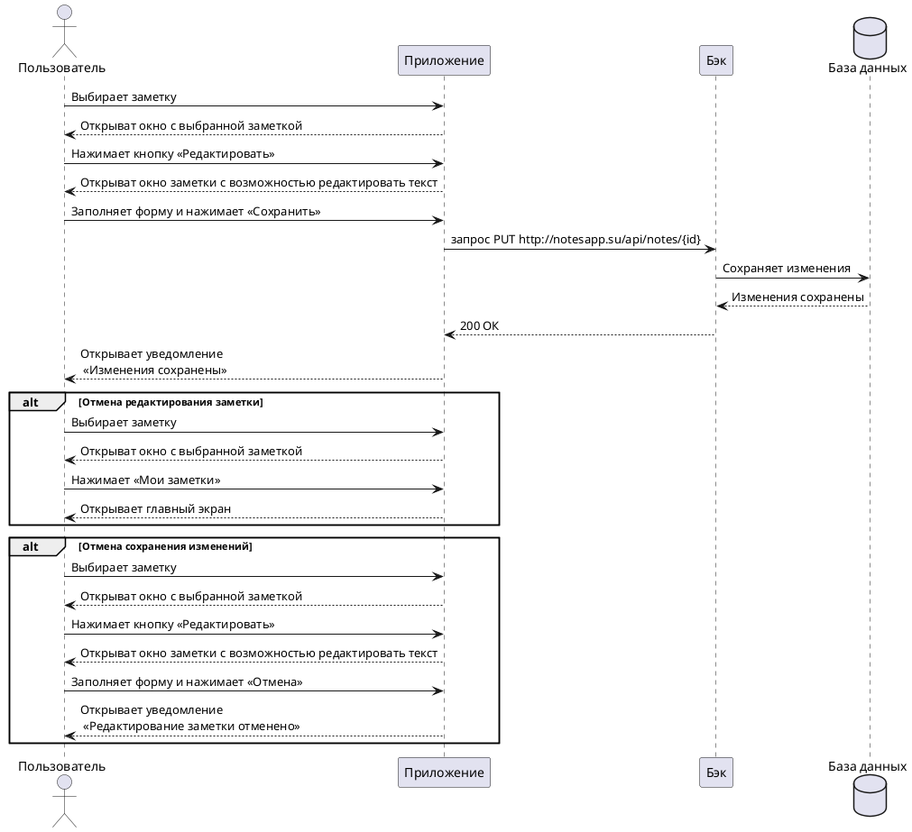

---
hide:
 - toc
---
# Пользовательский сценарий «Редактирование заметки» 

## Действующие лица:
1. Пользователь
2. Приложение
3. Бэк
4. База данных

## Предварительные условия

Пользователь должен находиться на главном экране.

## Выходные условия

В системе сохранились изменения в заметке.

## Основной сценарий

1. Пользователь выбирает заметку, которую хочет редактировать.
2. Приложение открывает окно с выбранной заметкой.
3. Пользователь нажимает кнопку **Редактировать**.
4. Приложение открывает окно заметки с возможностью редактировать текст.
5. Пользователь редактирует текст выбранной заметки.
6. Пользователь нажимает кнопку **Сохранить**.
7. Приложение отправляет запрос Бэку на сохранение изменений.
8. Бэк сохраняет изменения в Базе данных.
9. Бэк возвращает Приложению ответ об успешном сохранении изменений.
10. Приложение открывает пользователю уведомление «Изменения сохранены».

## Альтернативный сценарий «Отмена редактирования заметки» ##

1. Пользователь выбирает заметку, которую хочет редактировать.
2. Приложение открывает окно с выбранной заметкой.
3. Пользователь нажимает кнопку **Мои заметки**.
4. Приложение открывает пользователю главный экран.

## Альтернативный сценарий «Отмена сохранения изменений» ##
1. Пользователь выбирает заметку, которую хочет редактировать.
2. Приложение открывает окно с выбранной заметкой.
3. Пользователь нажимает кнопку **Редактировать**.
4. Приложение открывает окно заметки с возможностью редактировать текст заметки.
5. Пользователь редактирует текст выбранной заметки.
6. Пользователь нажимает кнопку **Отменить**.
7. Приложение открывает пользователю уведомление «Редактирование заметки отменено».

# Диаграмма последовательности

