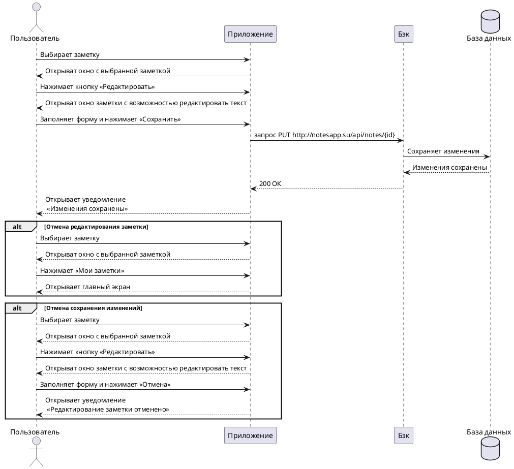

---
hide:
 - toc
---
# Диаграмма последовательности

```puml
@startuml
actor Пользователь
participant Приложение
participant Бэк
database "База данных"

Пользователь -> Приложение: Выбирает заметку
Пользователь <-- Приложение: Открыват окно с выбранной заметкой
Пользователь -> Приложение: Нажимает кнопку «Редактировать»
Пользователь <-- Приложение: Открыват окно заметки с возможностью редактировать текст
Пользователь -> Приложение: Заполняет форму и нажимает «Сохранить»
Приложение -> Бэк: запрос PUT http://notesapp.su/api/notes/{id}
Бэк -> "База данных": Сохраняет изменения
Бэк <-- "База данных": Изменения сохранены
Бэк --> Приложение: 200 ОК
Приложение --> Пользователь: Открывает уведомление\n «Изменения сохранены»

alt Отмена редактирования заметки
Пользователь -> Приложение: Выбирает заметку
Пользователь <-- Приложение: Открыват окно с выбранной заметкой
Пользователь -> Приложение: Нажимает «Мои заметки»
Приложение --> Пользователь: Открывает главный экран
end alt

alt Отмена сохранения изменений
Пользователь -> Приложение: Выбирает заметку
Пользователь <-- Приложение: Открыват окно с выбранной заметкой
Пользователь -> Приложение: Нажимает кнопку «Редактировать»
Пользователь <-- Приложение: Открыват окно заметки с возможностью редактировать текст
Пользователь -> Приложение: Заполняет форму и нажимает «Отмена»
Пользователь <-- Приложение: Открывает уведомление\n «Редактирование заметки отменено»
end alt

@enduml
```